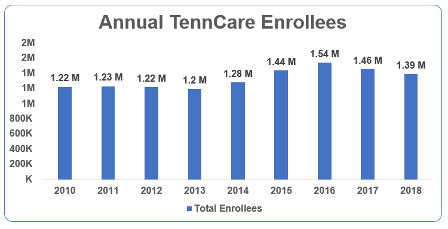
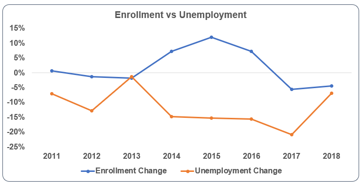
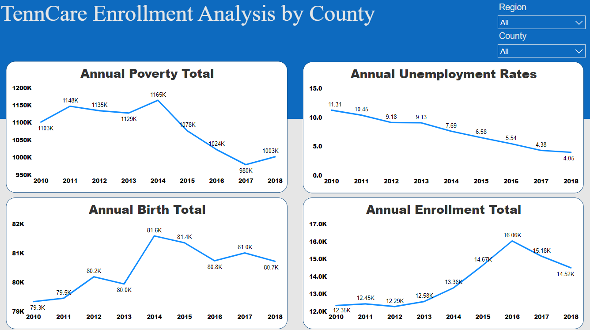

# TennCare Enrollment Analysis

### Inspiration
With the growing cost of healthcare anticipated to rise by an average of 5.5 percent per year over the next decade — growing from $3.5 trillion in 2017 to $6 trillion by 2027, I wanted to look at the Tennessee Medicaid program (TennCare) to see how it's numbers have been impacted over the last 9 years and what counties have been impacted the most.

### Data Selection
To answer these questions, I looked at TennCare's public enrollment numbers and compared it to unemployment rates, population rates, birth rates and poverty rates.

### Visualization
Bar graphs were used to simply and quickly show a comparison between the different datasets.

## Tools Used

* **Excel** for creating the bar charts
* **Pandas** for data cleaning and analysis.
* **Power BI** for data visualization

## Project Screenshots

### Total Enrollees

### Enrollment vs. Unemployment

### Power BI Dashboard

